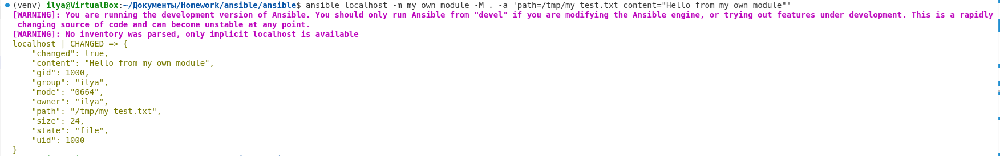
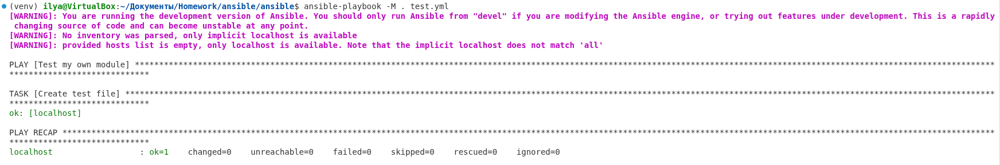

# Netology — Custom Ansible Module and Collection

**Студент:** Илья Демин

## Collection

Репозиторий GitHub:

https://github.com/deminilyadev-maker/my_own_collection

Название collection:

`my_own_namespace.yandex_cloud_elk`

Версия collection:

`1.0.0`

Архив collection:

`my_own_namespace-yandex_cloud_elk-1.0.0.tar.gz`

---

## Шаг 1. Создание `my_own_module.py`

В виртуальном окружении Ansible был создан новый файл `my_own_module.py`.

За основу был взят стандартный шаблон пользовательского модуля Ansible.

## Шаг 2. Заполнение модуля

Модуль был оформлен в соответствии с требованиями Ansible.

В модуле присутствуют:

- `DOCUMENTATION`
- `EXAMPLES`
- `RETURN`
- `AnsibleModule`
- описание параметров
- функция `run_module()`
- функция `main()`

## Шаг 3. Реализация основной задачи

Модуль был изменён таким образом, чтобы создавать текстовый файл на удалённом хосте.

Модуль принимает два обязательных параметра:

| Параметр | Тип | Описание |
|---|---|---|
| `path` | string | Путь к создаваемому текстовому файлу |
| `content` | string | Содержимое текстового файла |

Логика работы модуля:

1. Проверяется существование файла.
2. Если файл существует, считывается его текущее содержимое.
3. Если содержимое уже соответствует требуемому, файл не изменяется.
4. Если файла нет, он создаётся.
5. Если содержимое отличается, файл обновляется.
6. Реализована поддержка `check mode`.

## Шаг 4. Локальная проверка модуля

Пользовательский модуль был проверен локально с помощью Ansible.

Модуль успешно выполнился и создал требуемый файл.



## Шаг 5. Создание single task playbook

Был создан playbook с одной задачей для использования пользовательского модуля.

Playbook создаёт файл:

`/tmp/my_test.txt`

с содержимым:

`Hello from my own module`

## Шаг 6. Проверка идемпотентности

Playbook был запущен повторно для проверки идемпотентности.

При наличии файла с уже заданным содержимым модуль не выполняет повторное изменение и возвращает:

`changed=0`



## Шаг 7. Выход из виртуального окружения

После завершения первоначального тестирования модуля виртуальное окружение было закрыто.

## Шаг 8. Инициализация collection

Была создана новая Ansible collection:

`my_own_namespace.yandex_cloud_elk`

Для создания использовалась команда:

```bash
ansible-galaxy collection init my_own_namespace.yandex_cloud_elk
```

## Шаг 9. Перенос модуля в collection

Созданный пользовательский модуль был перенесён в соответствующую директорию collection:

```text
plugins/modules/my_own_module.py
```

Структура collection содержит:

```text
my_own_namespace/
└── yandex_cloud_elk/
    ├── plugins/
    │   └── modules/
    │       └── my_own_module.py
    ├── roles/
    │   └── my_own_role/
    ├── galaxy.yml
    ├── README.md
    └── test_role.yml
```

## Шаг 10. Создание role

Single task playbook был преобразован в single task role.

Название role:

`my_own_role`

Role использует пользовательский модуль:

`my_own_namespace.yandex_cloud_elk.my_own_module`

В `defaults/main.yml` определены все параметры модуля:

```yaml
---
path: /tmp/my_test.txt
content: "Hello from my own module"
```

## Шаг 11. Создание playbook для role

Был создан playbook для использования role через полное имя collection:

`my_own_namespace.yandex_cloud_elk.my_own_role`

Playbook был успешно протестирован.

## Шаг 12. Документация и публикация collection

Документация collection была подготовлена.

Collection опубликована в собственном GitHub-репозитории:

https://github.com/deminilyadev-maker/my_own_collection

Версия collection:

`1.0.0`

На соответствующий commit был установлен Git tag:

`1.0.0`

## Шаг 13. Создание архива collection

В корневой директории collection была выполнена команда:

```bash
ansible-galaxy collection build
```

В результате был создан архив:

```text
my_own_namespace-yandex_cloud_elk-1.0.0.tar.gz
```

## Шаг 14. Создание отдельной директории

Для проверки collection из локального архива была создана отдельная директория:

```text
collection_test/
├── my_own_namespace-yandex_cloud_elk-1.0.0.tar.gz
└── test_role.yml
```

В неё были перенесены:

- single task playbook;
- архив collection.

## Шаг 15. Установка collection из локального архива

Collection была установлена из локального архива командой:

```bash
ansible-galaxy collection install my_own_namespace-yandex_cloud_elk-1.0.0.tar.gz
```

Установка завершилась успешно.


## Шаг 16. Запуск playbook

После установки collection из локального архива был запущен playbook для проверки её работоспособности.

Playbook успешно обнаружил и выполнил role:

`my_own_namespace.yandex_cloud_elk.my_own_role`

Выполнение завершилось без ошибок.


### Collection

https://github.com/deminilyadev-maker/my_own_collection

### Архив

`my_own_namespace-yandex_cloud_elk-1.0.0.tar.gz`
